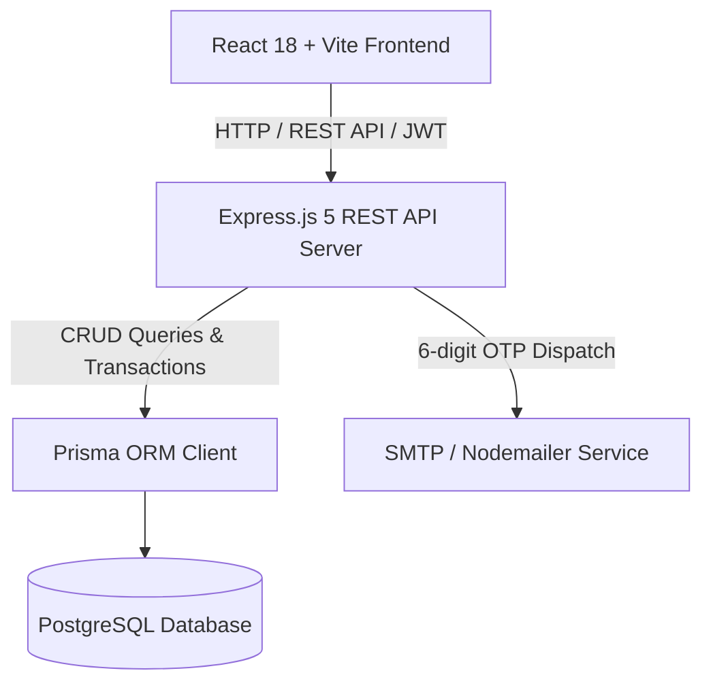

# 📚 Central Library Management System

[](https://nodejs.org/)
[](https://react.dev/)
[](https://vitejs.dev/)
[](https://expressjs.com/)
[](https://www.postgresql.org/)
[](https://www.prisma.io/)
[](LICENSE)

A modern, full-stack academic **Library Management System** built with **React**, **Node.js/Express**, **Prisma ORM**, and **PostgreSQL**. Designed for higher-education institutions, the platform streamlines circulation, catalog search, fine calculation, reservation queues, and institutional email OTP-based authentication.

---

## 📑 Table of Contents

- [Key Features](#-key-features)
- [System Architecture](#-system-architecture)
- [Tech Stack](#-tech-stack)
- [Repository Structure](#-repository-structure)
- [Getting Started](#-getting-started)
  - [Prerequisites](#prerequisites)
  - [Environment Configuration](#environment-configuration)
  - [Database Setup & Seeding](#database-setup--seeding)
  - [Running the Application](#running-the-application)
- [Demo Credentials](#-demo-credentials)
- [REST API Reference](#-rest-api-reference)
- [Database Schema](#-database-schema)
- [License](#-license)

---

## ✨ Key Features

### 🔐 Domain-Restricted Auth & Verification
- **Institutional Email Validation**: Restricts student registrations to authorized institutional domains (e.g. `@student.nitandhra.ac.in`).
- **Nodemailer OTP System**: 6-digit numeric email verification codes with expiration handling prior to account creation.
- **Role-Based Access Control (RBAC)**: Distinct permissions and views for **Students** and **Librarians** secured via JWT tokens and bcrypt password hashing.

### 📖 Catalog & Physical Shelf Tracking
- **Granular Classification**: Books mapped across categories (e.g. Computer Science, Mechanical Engineering, Literature) and academic departments.
- **Physical Rack & Section Mapping**: Exact shelf section and rack number coordinates (e.g., *Section A, Rack A1*) stored with real-time copy availability.
- **Search & Filter**: Search by title, author, category, department, or ISBN.

### 🔄 Circulation Desk & Borrowing Lifecycle
- **Issue & Return Tracking**: Automated loan periods (default 14 days), due date enforcement, and return status recording.
- **Renewals**: Configurable renewal limits (default 2 renewals, +7 days extension per renewal).
- **Borrow History**: Complete audit trail of past borrow and return transactions per student.

### ⏳ Waitlist & Reservation Queues
- **Queue Allocation**: Students can reserve out-of-stock books with sequential queue positioning.
- **Reservation Status Tracking**: Automatic updates as books become available or are fulfilled.

### 💰 Automated Fines & Penalty Management
- **Daily Overdue Calculation**: Configurable automated daily overdue penalties ($5/day default).
- **Fine Categorization**: Overdue returns, physical damage, lost books, and late renewal fees.
- **Settlement & Payment Tracking**: Payment status recording with payment methods and transaction IDs.

### 📢 Institutional Bulletins & Announcements
- Real-time announcement feed for library notices, operating hours, holiday schedules, and event updates.

---

## 🏛 System Architecture



---

## 🛠 Tech Stack

### Frontend
- **Framework**: [React 18](https://react.dev/) + [Vite](https://vitejs.dev/)
- **Routing**: [React Router v6](https://reactrouter.com/)
- **HTTP Client**: [Axios](https://axios-http.com/)
- **Styling**: Vanilla CSS3 with responsive glassmorphic design system
- **Linting**: [Oxlint](https://oxc.rs/)

### Backend
- **Runtime**: [Node.js](https://nodejs.org/) (ES Modules)
- **Framework**: [Express 5](https://expressjs.com/)
- **ORM**: [Prisma ORM v6](https://www.prisma.io/)
- **Database**: [PostgreSQL](https://www.postgresql.org/)
- **Security**: [bcrypt](https://www.npmjs.com/package/bcrypt) (password hashing), [jsonwebtoken](https://jwt.io/) (JWT session tokens)
- **Email Delivery**: [Nodemailer](https://nodemailer.com/)

---

## 📂 Repository Structure

```text
Library_Management_System/
├── package.json               # Root monorepo configuration (concurrently runner)
├── .gitignore
│
├── client/                    # React + Vite Frontend
│   ├── public/                # Static assets
│   ├── src/
│   │   ├── assets/            # UI icons and images
│   │   ├── components/        # Reusable components (Navbar, etc.)
│   │   ├── pages/             # Route views (Landing, Auth, Student & Librarian Dashboards)
│   │   ├── styles/            # Scoped CSS stylesheets
│   │   ├── App.jsx            # Main app router
│   │   ├── main.jsx           # React DOM entrypoint
│   │   └── index.css          # Global typography and theme tokens
│   ├── .env                   # Frontend API endpoint config
│   ├── package.json
│   └── vite.config.js
│
└── server/                    # Node.js + Express + Prisma Backend
    ├── config/                # Environment and app configuration
    ├── controllers/           # Route controller handlers
    │   ├── announcementController.js
    │   ├── authController.js
    │   ├── bookController.js
    │   ├── categoryController.js
    │   ├── circulationController.js
    │   ├── constantController.js
    │   ├── departmentController.js
    │   ├── fineController.js
    │   ├── otpController.js
    │   ├── reservationController.js
    │   ├── shelfController.js
    │   └── studentController.js
    ├── prisma/
    │   ├── schema.prisma      # PostgreSQL Prisma relational schema
    │   └── seed.js            # Comprehensive database seeder (~100 books + demo users)
    ├── routes/                # Express API router definitions
    ├── services/              # Email & OTP notification services
    ├── utils/                 # Auth & domain verification helpers
    ├── app.js                 # Express middleware & route mounting
    ├── server.js              # Server bootstrapper & port listener
    ├── .env                   # Backend environment variables
    └── package.json
```

---

## 🚀 Getting Started

### Prerequisites

Ensure you have the following installed on your machine:
- **Node.js**: `v18.0.0` or higher
- **npm**: `v9.0.0` or higher
- **PostgreSQL**: `v14.0` or higher

---

### Environment Configuration

#### 1. Server Environment (`server/.env`)

Create a file named `.env` inside the `server/` directory:

```env
# PostgreSQL Database Connection URL
DATABASE_URL="postgresql://<DB_USER>:<DB_PASSWORD>@localhost:5432/<DB_NAME>?schema=public"

# Database individual credentials (optional fallback)
DB_HOST=localhost
DB_PORT=5432
DB_USER=postgres
DB_PASSWORD=your_postgres_password
DB_NAME=library_management

# Authentication
JWT_SECRET=your_super_secret_jwt_key_here

# Nodemailer OTP Sender Credentials (e.g. Gmail App Password)
EMAIL_USER=your_email@gmail.com
EMAIL_PASS=your_app_specific_password
```

> [!TIP]
> If using Gmail for Nodemailer, generate a 16-character **App Password** from your Google Account security settings.

#### 2. Client Environment (`client/.env`)

Create a file named `.env` inside the `client/` directory:

```env
VITE_API_URL=http://localhost:5000/api
```

---

### Database Setup & Seeding

1. Open your terminal and navigate to the `server/` directory:
   ```bash
   cd server
   ```

2. Run Prisma migration / push to generate the database tables:
   ```bash
   npx prisma db push
   ```

3. Generate the Prisma Client:
   ```bash
   npx prisma generate
   ```

4. Populate the database with 100+ real-world engineering books, categories, shelves, library constants, and default accounts:
   ```bash
   npm run seed
   ```

---

### Running the Application

You can start both frontend and backend concurrently from the root directory:

#### Install all dependencies:
```bash
# In the root directory
npm install
npm --prefix server install
npm --prefix client install
```

#### Run both Server and Client:
```bash
# In the root directory
npm run dev
```

Or run them individually in separate terminal sessions:

```bash
# Terminal 1: Start Backend Server (runs on http://localhost:5000)
cd server
npm run dev

# Terminal 2: Start Frontend Client (runs on http://localhost:5173)
cd client
npm run dev
```

---

## 🔑 Demo Credentials

After running the database seed script (`npm run seed`), use the following accounts to test the application:

| Role | Email | Password | Identifier |
| :--- | :--- | :--- | :--- |
| **Student** | `student@example.com` | `Password123!` | Roll No: `21CS001` |
| **Librarian** | `librarian@example.com` | `Password123!` | Staff ID: `LIB101` |

> [!NOTE]
> During live student self-registration, students must provide an email ending in `@student.nitandhra.ac.in` and complete the OTP verification flow.

---

## 📡 REST API Reference

All backend API endpoints are prefixed with `/api`.

### 🔐 Authentication & OTP
| Method | Endpoint | Description |
| :--- | :--- | :--- |
| `POST` | `/api/auth/send-otp` | Generate and email OTP verification code |
| `POST` | `/api/auth/verify-otp` | Validate submitted OTP code |
| `POST` | `/api/auth/register` | Register new student or librarian profile |
| `POST` | `/api/auth/login` | Authenticate user and issue JWT token |

### 📚 Books & Catalog
| Method | Endpoint | Description |
| :--- | :--- | :--- |
| `GET` | `/api/books` | Retrieve all books (supports query search) |
| `GET` | `/api/books/:id` | Get book details, stock, and shelf location |
| `POST` | `/api/books` | Add a new book to catalog (Librarian) |
| `PUT` | `/api/books/:id` | Update book metadata and availability |
| `DELETE`| `/api/books/:id` | Remove a book from catalog |

### 🔄 Circulation Desk
| Method | Endpoint | Description |
| :--- | :--- | :--- |
| `GET` | `/api/issued-books` | Retrieve all active and past issued books |
| `POST` | `/api/issued-books` | Issue a book to a student |
| `POST` | `/api/issued-books/:id/return` | Process return and compute overdue fines |
| `POST` | `/api/issued-books/:id/renew` | Extend loan period for eligible book |

### ⏳ Reservations
| Method | Endpoint | Description |
| :--- | :--- | :--- |
| `GET` | `/api/reservations` | List all active reservations |
| `POST` | `/api/reservations` | Reserve a book & assign queue position |
| `PATCH`| `/api/reservations/:id/cancel` | Cancel an active reservation |

### 💳 Fines & Payments
| Method | Endpoint | Description |
| :--- | :--- | :--- |
| `GET` | `/api/fines` | Fetch all issued fines (filterable by student) |
| `GET` | `/api/fines/:id` | Fetch specific fine and payment status |
| `POST` | `/api/fines/:id/pay` | Record a fine settlement payment |

### 📢 Announcements & Constants
| Method | Endpoint | Description |
| :--- | :--- | :--- |
| `GET` | `/api/announcements` | Retrieve active announcements |
| `POST` | `/api/announcements` | Create new announcement |
| `DELETE`| `/api/announcements/:id` | Delete announcement |
| `GET` | `/api/constants` | Fetch global library borrow & fine rules |
| `PUT` | `/api/constants` | Update global library borrow & fine limits |

### 🗄️ Categories, Departments & Shelves
| Method | Endpoint | Description |
| :--- | :--- | :--- |
| `GET` | `/api/categories` | List all book categories |
| `POST` | `/api/categories` | Add book category |
| `GET` | `/api/departments` | List academic departments |
| `POST` | `/api/departments` | Add academic department |
| `GET` | `/api/shelves` | List shelf sections and rack numbers |
| `POST` | `/api/shelves` | Create new shelf storage location |

---

## 🗃️ Database Schema

The PostgreSQL database is organized with clean relational mappings:

- **`User`** (`users`): Base credentials, authentication hash, role (`STUDENT` / `LIBRARIAN`).
- **`Student`** (`students`): Roll number, department, study year, relations to loans and fines.
- **`Librarian`** (`librarian`): Staff ID, email, linked announcement creations.
- **`Otp`** (`otps`): Email, 6-digit code, expiration timestamp, verification flag.
- **`Book`** (`books`): ISBN, title, author, category, department, description, publication year.
- **`BookAvailability`** (`book_availability`): Physical copy tracking (total vs. available copies) linked to shelves.
- **`Shelf`** (`shelf`): Section name and rack identifier.
- **`IssuedBook`** (`issued_books`): Issue date, due date, return date, renewal counter, linked fines.
- **`BookReservation`** (`book_reservations`): Queue order, reservation timestamps, status.
- **`Fine`** & **`FinePayment`** (`fines`, `fine_payments`): Penalty amounts, payment logs, transaction numbers.
- **`LibraryConstants`** (`library_constants`): Centralized borrowing policy configurations.
- **`Announcement`** (`announcements`): Public board announcements.

---

## 📄 License

This project is licensed under the [ISC License](LICENSE).
